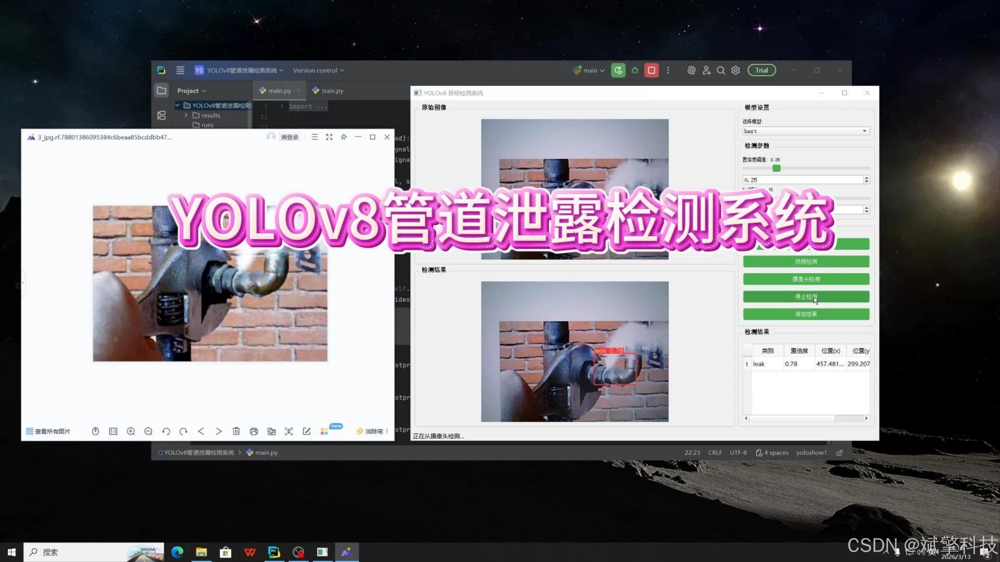
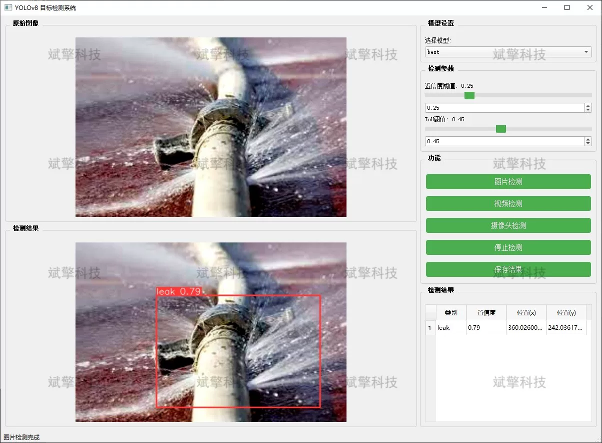
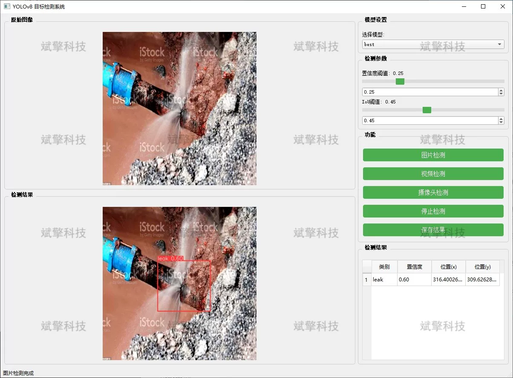
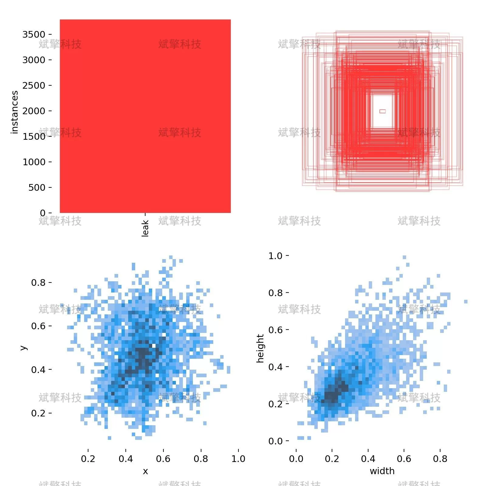

# YOLOv8 pipeline leak detection system

## Body

YOLOv8 Pipeline Leakage Detection System Based on YOLOv8 Deep Learning (YOLOv8+YOLO dataset + UI interface + Python project source code + model)

With the continuous development of industrial production, pipeline transportation plays a crucial role in oil, chemical, urban water supply, and gas supply fields. However, due to factors such as equipment aging, corrosion, or external damage, pipeline leak accidents occur frequently, not only causing resource waste and economic losses but also potentially leading to serious environmental pollution and safety incidents. Traditional leak detection methods rely on manual inspection or physical sensors, which have limitations such as low efficiency, slow response, and limited coverage.
In response to these challenges, this project has designed and implemented an efficient and intelligent pipeline leak detection system based on the YOLOv8 deep learning algorithm. The system can automatically identify pipeline leak areas in image or video streams through training a high-precision target detection model. The project implements three core functions: image detection, video file detection, and real-time camera detection, providing users with flexible and comprehensive detection solutions. Experimental results show that the system can accurately recognize leak characteristics in complex backgrounds, with fast detection speed and high accuracy, providing strong technical support for intelligent patrolling and real-time warnings of industrial pipelines.

System Features

✅ Image Detection: Can detect images and return detection boxes and category information.

✅ Video Detection: Supports input of video files, detecting each frame in the video.

✅ Real-time Camera Detection: Connects USB cameras to achieve real-time monitoring.

✅ Parameter Real-Time Adjustment (Confidence and IoU Thresholds)

Dataset Overview

Training set: 3481 images
Validation set: 911 images

## Images

## Payment

Here is a pay link on Stripe ( https://buy.stripe.com/3cs8yP7sY87d0vu9AB ). Please contact me lonlonago@foxmail.com after funding $89, and I will send you a complete data files , thank you!

